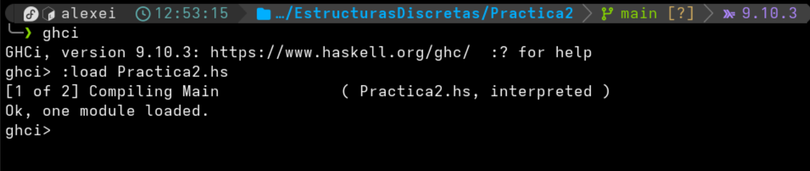

# Practica 2 - Thinking in Haskell (Introducción)

## Objetivo
El objetivo de la practica es aprender el uso del compilador interactivo de Haskell (GHCI) y los comandos principales de este para poder trabajar con codigo fuente en Haskell.

Tambien aprender las distintas operaciones basicas que permite el lenguaje y el modelado de problemas mediante funciones para resolverlos. Ademas adquirir algunas buenas practicas como: documentar las funciones con comentarios y el uso de commits atomicos para tener un historial de cambios organizado.

## Tiempo requerido
Aproximadamente 3 horas.

## Promp

